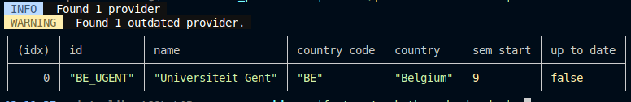

# Course providers
This repository is responsible for creating a list of courses from each provided institution, which can then be uploaded to the backend

## Commands
### Get a list of available providers and check if they are up-to-date
`$ deno run --allow-env --allow-read --allow-write main.ts list`



### Add a new provider
First do a search in https://raw.githubusercontent.com/Hipo/university-domains-list/refs/heads/master/world_universities_and_domains.json and note the first domain name of the institution you want to add (e.g. ugent.be).

Now run the following command:
`$ deno run --allow-env --allow-read --allow-write --allow-net main.ts add ugent.be`

You will now see a new folder in the providers directory: `BE_UGENT`. For more information about the folder structure, see below.

## Providers
Every subfolder contains the code necessary to generate a course list for a specific institution.

### Folder name format
The format is as follows: **{COUNTRY-CODE}_{DOMAIN}**
- **{COUNTRY-CODE}**: ISO-3166 code for institution's country
- **{DOMAIN}**: domain name of institution

### Folder contents format

#### `manifest.json`
Contains information about the institution, see https://raw.githubusercontent.com/Hipo/university-domains-list/refs/heads/master/world_universities_and_domains.json for format
```json
{
    // Information provided by university-domains-list
    "web_pages": ["https://www.ugent.be/", "http://www.rug.ac.be/"],
    "name": "Universiteit Gent",
    "alpha_two_code": "BE",
    "state-province": "",
    "domains": ["ugent.be", "rug.ac.be"],
    "country": "Belgium",

    // First semester start month to schedule provider rerun
    "sem_start": 9
}
```

#### `provider.ts`
Contains the course list generator, look at the `provider.ts` file of the `BE_UGENT` provider for more information. If your institution is kind enough to provide a json file with their courses, you can do transformations to the data here. Web scraping is also an option.

Expects a default exported async function.

#### `course_list_YEAR.json`
Contains the course list for the institution, format is as follows:
```json
[
    ...,
    {
        "title": "Example Course",
        "course_code": "A000186", // Most institutions have identifiers for their courses, these must be unique
        "instructor": "Example instructor",
        "weight": 3, // Corresponds to European Credit Points, see https://en.wikipedia.org/wiki/European_Credit_Transfer_and_Accumulation_System. Set to zero if your institution does not provide this
        "language": "nl" // ISO 639 language code, see https://en.wikipedia.org/wiki/List_of_ISO_639_language_codes
    },
    ...
]
```

